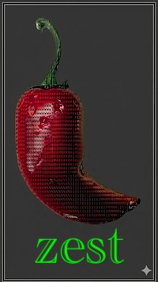

# zest

Animate your terminal prompt into view with a choice of effects. The animation is written directly to `/dev/tty`, then the final prompt is emitted on `stdout`, compatible with fish and zsh prompt mechanics. Any typing input will interrupt the animation and immediately draw in your configured prompt, so it doesn't get in the way of your work.

This util is just for fun and is not battle-tested! Use at your own risk.



## Install

Install [Rust](https://rust-lang.org/tools/install/), then...

```bash
cargo install --path .
```

## Fish integration

Wrap your prompt's output commands in a `begin ... end | zest` block.

`$status` and `$pipestatus` are reset by every command — including `set_color` and `echo` — so capture them **before anything else runs** in `fish_prompt`, as shown below. `__fish_last_status` is exported (`-x`) so that `fish_right_prompt`, which runs in a separate scope, can read it. Other fish-managed variables like `$CMD_DURATION`, `$PWD`, and `$USER` reflect shell state rather than command results, so they're safe to read inside the block.

```fish
function fish_prompt
    set -l last_pipestatus $pipestatus
    set -lx __fish_last_status $status
    begin
        set_color cyan
        echo -n (prompt_pwd)
        set_color normal
        printf '%s' (fish_vcs_prompt)
        set -l pipestatus_string (__fish_print_pipestatus "[" "]" "|" \
            (set_color red) (set_color red --bold) $last_pipestatus)
        echo -n $pipestatus_string
        set_color brcyan
        echo -n " ❯ "
        set_color normal
    end | zest
end
```

Each time a new prompt renders, the selected animation fires and then settles into the configured prompt.

## Zsh integration

Move your prompt-building logic into a function that outputs with `print -P` (which expands `%F{color}` etc. to ANSI codes), then pipe it through `zest`. zest auto-detects zsh via `$ZSH_VERSION` and wraps ANSI codes in `%{...%}` so zsh counts prompt width correctly.

```zsh
function my_prompt() {
    print -Pn '%F{cyan}%~%f'
    print -Pn '%F{cyan} ❯ %f'
}
setopt PROMPT_SUBST
PROMPT='$(my_prompt | zest)'
```

If your prompt already uses raw ANSI codes (`$'\x1b[36m'` etc.) rather than `%`-escapes, just pipe the existing output through `zest`.

For a more complete setup using `vcs_info`, exit-status display, and virtualenv detection:

```zsh
autoload -Uz vcs_info
zstyle ':vcs_info:*'      enable          git
zstyle ':vcs_info:git:*'  formats         ' %F{magenta}(%b%u%c)%f'
zstyle ':vcs_info:git:*'  actionformats   ' %F{yellow}(%b|%a)%f'
zstyle ':vcs_info:git:*'  check-for-changes true
zstyle ':vcs_info:git:*'  unstagedstr     '%F{red}✘%f'
zstyle ':vcs_info:git:*'  stagedstr       '%F{green}✚%f'

precmd() {
    _prompt_status=$?   # capture before anything else runs
    vcs_info
}

_build_prompt() {
    # Non-zero exit: show red status code
    (( _prompt_status )) && print -Pn "%F{red}✘${_prompt_status} %f"
    # Active virtualenv: show env name
    [[ -n $VIRTUAL_ENV ]] && print -Pn "%F{yellow}(${VIRTUAL_ENV:t}) %f"
    # cwd + git info
    print -Pn '%F{cyan}%~%f'
    print -Pn "${vcs_info_msg_0_}"
    # % for root, ❯ otherwise
    print -Pn ' %(#.%F{red}%.%F{cyan}❯)%f '
}

setopt PROMPT_SUBST
PROMPT='$(_build_prompt | zest flames)'
RPROMPT='%F{240}%*%f'   # right-side clock is plain — only left prompt pipes through zest
```

`precmd` captures `$?` before `vcs_info` can overwrite it. `RPROMPT` is left as a static `%`-escape — only the left prompt needs the animation.

## Animations

See `zest help`

### Customization

```shell
--duration 1000 # set animation to last 1000 milliseconds
--gradient :130,94,88,52 # add orangey background glow to leading four characters of sweep
```

Run the `colors.sh` script to see the 256-color palette.

## Acknowledgements

Much of this project was written by Claude under human supervision.
